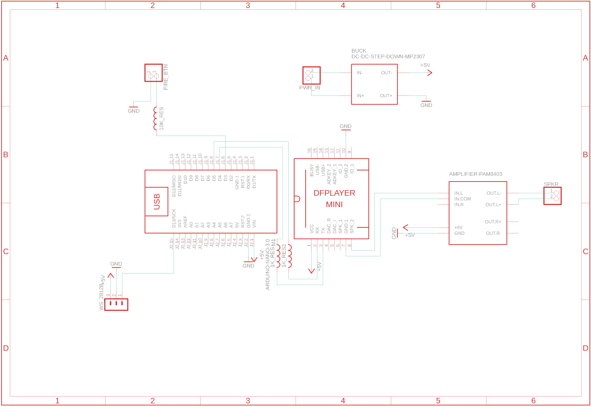

## mando-blaster 1.0
This is a simple Arduino sketch for building electronic kits for various 3d printed
blasters using Ardunio components.

## Arduino Components
* Arduino Nano v3
* DF Player Mini
* Speaker Amp - PAM8302A
* Single LED - Neopixel
* 40mm 2W speaker
* 7mm momentary switch
* 5v Regulator - LM2596
* Lipo 7.4v


## Required Libraries
There's are number of libraries that you will need to install using the  Library Manager:
 1. DFPlayerMini_Fast
 2. FastLED
 4. FireTimer
 5. ezButton

## Setup and Configuration
The code can be used by updating the values in config.h based on your components,
wiring, and audio tracks.

```c++   
#define ENABLE_DEBUG               0

// Enable any items in your setup by uncommenting
#define ENABLE_EASY_AUDIO          1 //Enable all audio 
#define ENABLE_EASY_BUTTON         1 //Enable all buttons

// Pin configuration for MP3 Player
#define AUDIO_RX_PIN        10
#define AUDIO_TX_PIN        11

// Pin configuration for all momentary triggers
#define TRIGGER_PIN         8

// Pin configuration for front barrel WS2812B LED
#define SINGLE_LED_CNT      1
#define FIRE_LED_PIN        13 

// track by file index
#define TRACK_START_UP        1
#define TRACK_CHANGE_MODE     2
#define TRACK_FIRE_A          3
#define TRACK_FIRE_B          4
#define TRACK_STUN_A          5
#define TRACK_STUN_B          6
#define TRACK_CLIP_RELOAD     7
#define TRACK_CLIP_EMPTY      8
#define TRACK_THEME           9
```

## Audio File Setup
The DF Mini Player will play back both mp3 and wav files. However, the program play
back tracks based on index. The index is determined by the order the files are loaded
onto the card. It also expects all files to be loaded into a sub directory on the card
called "/mp3".

When using a MAC to load files, it will create hidden files that will cause the playback
to seem like it's not working. You'll need to use the terminal window to rm all of these
files and directories from the card.

## Example Wiring Diagram:

